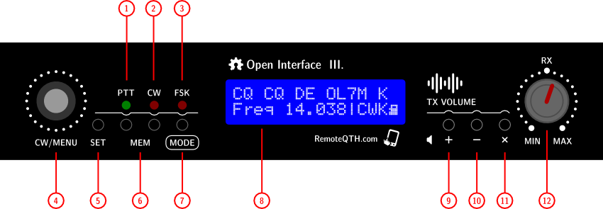
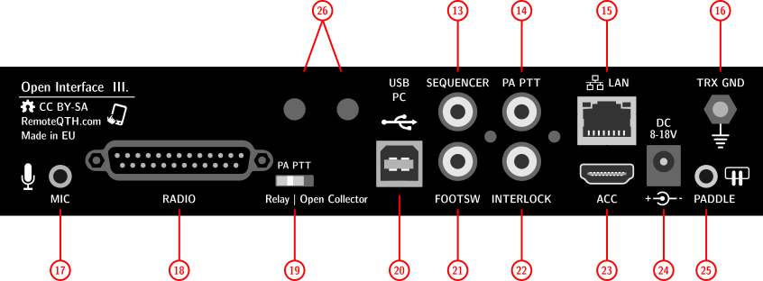
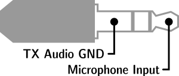
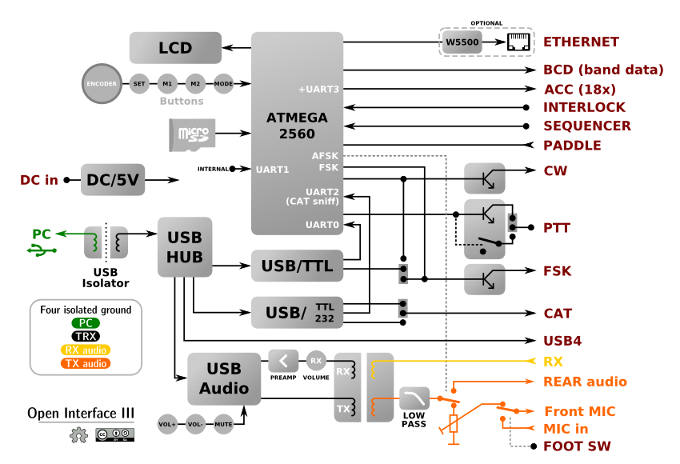
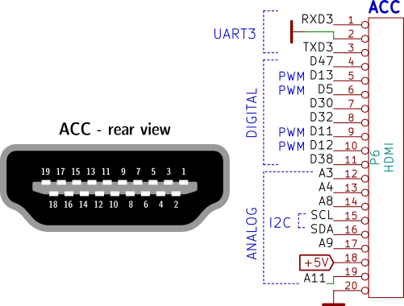
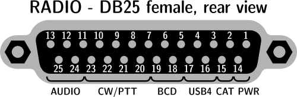

# Open Interface III — Hardware Description

This document is derived from the wiki page [logic.qro.cz/remoteqth — Open Interface III](https://logic.qro.cz/remoteqth/wiki/index.php?page=Open+interface+III) and covers only the hardware. The Firmware, Expansion device, ToDo and Quick Start Guide sections are omitted.

Source: RemoteQTH.com, licensed under CC BY-SA 4.0.

---

## Main Function

Open Interface III is an interface device between a computer and a transceiver. It provides access to controls, CAT communications and audio routing to the PC.

**Operating modes:**

- CW (full K3NG code implementation including WinKey emulation)
- SSB (microphone / USB audio switching)
- FSK/RTTY (three source options)
- DIGI modes (galvanically isolated audio paths via transformers)
- CAT (TTL for Icom, RS-232 for Kenwood/Yaesu)

**Additional features:**

- Band decoder with BCD and CAT outputs
- Galvanically isolated USB (four independent grounds)
- microSD card slot
- Optional Ethernet module
- INTERLOCK function (switches OFF all PTT signals)

---

## The Hardware

### Front Panel

Controls:

1. PTT LED indicator
2. CW LED indicator
3. FSK LED indicator
4. Rotary encoder (WPM / menu control)
5. SET / MEM 0 button
6. MEM 1–2 button
7. MODE button (short press = mode change; long press = menu activation)
8. 16×2 character LCD display
9–11. TX audio control buttons (UP / DOWN / MUTE)
12. RX volume potentiometer

LCD display:

- Line 1: transmitted character (CW/RTTY source identification)
- Line 2: active menu, mode indicator, microSD status

### Rear Panel

| # | Connector | Function |
|---|-----------|----------|
| 13 | RCA Cinch | SEQUENCER output (open collector, max 50 V / 500 mA) |
| 14 | RCA Cinch | PA-PTT output (relay or open collector) |
| 15 | RJ45 | LAN (optional Ethernet module) |
| 16 | M4 screw | TRX ground |
| 17 | 3.5 mm jack | Microphone input (JP7 preset required) |
| 18 | D-SUB 25 pin | RADIO connector (pinout below) |
| 19 | Switch | PA PTT output selection (relay / open collector) |
| 20 | USB Type-B | PC connection (isolated ground) |
| 21 | RCA Cinch | Foot switch (SSB PTT activation) |
| 22 | RCA Cinch | INTERLOCK input |
| 23 | HDMI type | ACC connector (covered by default — see warning) |
| 24 | DC jack 2.1/5.5 mm | Power input (8–18 V DC, center positive, 160 mA @ 12 V) |
| 25 | 3.5 mm jack | Paddle input |
| 26 | Mounting holes | Optional switches (reset, DTR control) |

### Microphone Configuration

JP7 jumper:

- OPEN = dynamic microphone
- SHORT = electret microphone

### Paddle Input

3.5 mm jack, activated by grounding the input. Configuration is available via firmware or command mode (after pressing the SET button).

### Block Diagram

### Internal Layout

Left side:

- microSD card slot
- RESET button

Opening the enclosure — remove 8 screws in total:

- 2 on the rear (near the RCA connectors)
- 3 on the left side
- 3 on the right side

---

## Board Configuration

### Jumper Presets

Accessible after opening the enclosure.

| Jumper | Function | Setting |
|--------|----------|---------|
| JP3 | Auto reset ON | SHORT (firmware upload only); OPEN (standard) |
| JP4 | DTR to CW/FSK | Selects DTR output activation source |
| JP5 | Self reset | OPEN (default) |
| JP7 | DC to MIC | OPEN (dynamic); SHORT (electret) |
| JP10 | CAT Icom / other | Left = Icom; Right = other |
| P5 | CAT level | 5 V TTL (Icom) or ±12 V RS232 |

### Potentiometer Adjustments

| Control | Function |
|---------|----------|
| P4 | LCD contrast |
| P2 | TX USB soundcard to microphone volume |

### Ethernet Module Installation

Compatible with the USR-ES1 module ([datasheet](hw/usr-es1-v1.3.pdf)):

1. Power OFF
2. Open the enclosure
3. Insert the module into the U9 pin strip
4. Break out the blind cover for the RJ45 connector
5. Configure firmware settings
6. Short JP3 before upload
7. Close the enclosure

### Internal Connectors

| Connector | Pins | Purpose |
|-----------|------|---------|
| K2 | 3 | ATmega Serial3 UART (RXD, TXD, GND @ 5 V) |
| P7 | 6 | ICSP (GND, RESET, MOSI, SCK, +5V, MISO) |
| P9 | – | Free USB4 output (DB-25 pin signals) |

### Unpopulated Components

Optional soldering for advanced features:

- **R6** (0805) — together with R9 reduces the audio signal level
- **C71** (C package) — increases RX preamp gain
- **C50** (0805) — activates USB left channel (TX)
- **D15, D16, D17** (0805) — direct PA PTT activation
- **JP1** — two-pin bridge (pre-bridged on the PCB)

---

## Hardware Operating Modes

| Mode | Source | PTT output | CW/FSK output |
|------|--------|-----------|---------------|
| CWK (Keyer) | PTT1 | HIGH | LOW |
| CWD (Daemon) | RTS | LOW | LOW |
| SSB | RTS / FootSW | LOW | LOW |
| FSK (EXTFSK) | RTS | LOW | LOW |
| FSK (Serial) | PTT1 | HIGH | LOW |
| DIG (AFSK) | RTS | LOW | HIGH |

Note: JP4 jumper selection is required for DTR/RTS CW/FSK routing.

---

## Known Issues

**USB disconnection:** Disconnecting the USB can create a high potential (measured 80 V AC) between USB-GND and TRX-GND. Mitigations:

- Ensure the case is grounded
- Replace the power supply with a grounded adapter (avoid ungrounded switching supplies)

---

## Accessory Connector (HDMI)

⚠ **WARNING:** All ACC signals connect directly to the ATMEGA chip with no ESD protection. ESD protection on these lines is strongly recommended before use.

| Pin | Signal | Function | Device link |
|-----|--------|----------|-------------|
| 1 | RXD | Serial3 | GPS-TXD |
| 2 | GND | Ground | ACC keyboard / GPS |
| 3 | TXD | Serial3 | GPS-RXD |
| 4 | D47 | Latch | ACC keyboard IN-LATCH |
| 5 | D13 | PWM | ACC keyboard IN-DATA |
| 6 | D5 | PWM | ACC keyboard IN-CLOCK |
| 7 | D30 | Latch | ACC keyboard OUT-LATCH |
| 8 | D32 | One-Wire | (planned) |
| 9 | D11 | PWM | ACC keyboard OUT-DATA |
| 10 | D12 | PWM | ACC keyboard OUT-CLOCK |
| 11 | D38 | Digital | – |
| 12 | A2 | Analog | – |
| 13 | A3 | Analog | – |
| 14 | A8 | Analog | – |
| 15 | SCL | I2C | ACC keyboard – Interrupt |
| 16 | SDA | I2C | GPS-1PPS |
| 17 | A9 | Analog | – |
| 18 | +5V | Power | ACC keyboard / GPS |
| 19 | A11 | Analog | – |
| 20 | GND | Ground | – |

---

## RADIO D-SUB 25-Pin Connector

| Pin | Direction | Function |
|-----|-----------|----------|
| 1 | IN | Power input 8–18 V DC |
| 2 | OUT | CAT TXD / CI-V |
| 3 | OUT | USB4 +5 V output |
| 4 | – | USB4 −Data |
| 5 | OUT | BCD4 TTL |
| 6 | OUT | BCD2 TTL |
| 7 | OUT | PA PTT |
| 8 | OUT | PTT1 |
| 9 | OUT | CW1 |
| 10 | OUT | FSK |
| 11 | OUT | Microphone (TX) |
| 12 | OUT | TX audio |
| 13 | IN | RX audio |
| 14 | – | Transceiver GND |
| 15 | IN | CAT RXD |
| 16 | – | USB4 +Data |
| 17 | – | Transceiver GND |
| 18 | OUT | BCD3 TTL |
| 19 | OUT | BCD1 TTL |
| 20 | OUT | PTT2 |
| 21 | OUT | CW2 |
| 22 | OUT | Microphone PTT |
| 23 | IN | Interlock |
| 24 | – | TX audio GND |
| 25 | – | RX audio GND |
| Shield | – | Transceiver GND |

---

## ATMEGA-2560 Pinout (Rev 3.1415)

### Serial & USB

- **RX0/TX0** — USB interface (upload & command)
- **TX2/RX2** — CAT (parallel to the USB interface; RX2 for sniffing)
- **TX3/RX3** — ACC Serial3 connector

### Interrupts

- **D2** (INT0) — Interlock input (external pull-up)
- **D3** (INT1) — PTT-232 input (external pull-up)
- **D18** (INT5) — Encoder-B (internal pull-up, optional external*)
- **D19** (INT4) — Foot switch PTT (external pull-up)
- **D20** (INT3) — SDA I2C
- **D21** (INT2) — SCL I2C

### Control Outputs

| Pin | Function | Notes |
|-----|----------|-------|
| D4 | CW tone | – |
| D22 | PTT2 | – |
| D23 | FSK keying | Arduino source |
| D25 | PTT3 | – |
| D27 | WinKey | HIGH during CW (disables DTR/RTS) |
| D29 | AFSK | HIGH when AFSK active (switches audio) |
| D31 | PTT-PA | – |
| D34 | CW1 | – |
| D35 | CW2 | – |
| D39 | Self reset | HIGH (requires JP5) |
| D40 | Sequencer | – |
| D41 | PTT1 | – |

### Band Decoder Outputs (BCD)

- **D42–D45** — BCD1–4 TTL band data

### Encoder Input

- **D24** — Encoder-A (internal pull-up, optional external*)
- **D18** — Encoder-B (internal pull-up, optional external*)

### Paddle Input

- **D26** — Paddle Left (external pull-up)
- **D28** — Paddle Right (external pull-up)

### FSK & Detection

- **D23** — FSK keying output
- **D33** — FSK detector input (external pull-up)

### Button Input

- **A1** — CW keyer memory button (external pull-up)
- **D36** — MODE button (external pull-up)

### LCD Control

| Pin | Function |
|-----|----------|
| D6–D9 | LCD Data 4–7 |
| D37 | LCD Enable |
| A2 | LCD RS (Register Select) |

### Analog Inputs

| Pin | Function |
|-----|----------|
| A3 | ACC pin 13 |
| A4 | ACC pin 13 |
| A6 | Measure 3.3 V |
| A7 | Measure input voltage (coefficient 11) |
| A8 | ACC pin 14 |
| A9 | ACC pin 17 |
| A11 | ACC pin 19 |

### SD Card & Ethernet

- **D53** — microSD Chip Select
- **A5** — microSD plug detect (internal pull-up)
- **D46** — Ethernet detect (internal pull-up)
- **D50–D52** — SPI bus (MISO, MOSI, SCK)
- **D10** — Ethernet SCS

### Free / Unassigned

- D48, D49 — internal SMT pads (free)
- A0, A10, A12–A15 — free analog pins

*If RC debounce circuits are installed on the encoder pins.

---

## Wiring Diagrams

Pre-configured wiring schematics for various transceivers:

- [Icom (generic)](hw/openinterface3-icom.pdf)
- [Icom IC706MKIIG](hw/openinterface3-ic706mkiig.pdf)
- [Kenwood TS590](hw/openinterface3-ts590.pdf)
- [Kenwood TS480](hw/openinterface3-ts480.pdf)
- [Yaesu FT2000](hw/openinterface3-ft2000.pdf)
- [Yaesu FT1000MP](hw/openinterface3-ft1000mp.pdf)
- [Elecraft KX3](hw/openinterface3-kx3.pdf)

---

## Circuit Schematic

[Full schematic (SVG)](hw/open-interface-31415.svg)

---

## Add-on: IP Switch Integration

Open Interface III cooperates with the IP Switch (ESP32-GATEWAY) via four control banks:

- **BankA** — first ACC keyboard line (IP switch outputs 0–7)
- **BankB** — second ACC keyboard line (IP switch outputs 8–15)
- **BankC** — left rotary encoder (IP switch outputs 8–F, LCD menu 20)
- **BankD** — band decoder (not yet implemented)

PCB modifications: populate C89, C90, R53, R55, R56, R57.

Separate documentation: [ACC keyboard for Open Interface III](https://logic.qro.cz/remoteqth/wiki/index.php?page=ACC+Keyboard+for+Open+Interface+III)

---

## Image Index

| Image | File |
|-------|------|
| Front panel | [img/wiki-open-interface-3-01.png](img/wiki-open-interface-3-01.png) |
| Rear panel | [img/wiki-open-interface-3-02.png](img/wiki-open-interface-3-02.png) |
| Block diagram | [img/wiki-open-interface-3-03.png](img/wiki-open-interface-3-03.png) |
| LCD display | [img/wiki-open-interface-3-04.png](img/wiki-open-interface-3-04.png) |
| Jumper diagram | [img/wiki-open-interface-3-05.png](img/wiki-open-interface-3-05.png) |
| D-SUB pinout | [img/wiki-open-interface-3-06.png](img/wiki-open-interface-3-06.png) |
| ACC connector | [img/wiki-open-interface-3-07.png](img/wiki-open-interface-3-07.png) |
| Microphone pinout | [img/wiki-open-interface-3-08.png](img/wiki-open-interface-3-08.png) |
| Paddle diagram | [img/wiki-open-interface-3-09.png](img/wiki-open-interface-3-09.png) |
| MQTT diagram | [img/wiki-open-interface-3-10.png](img/wiki-open-interface-3-10.png) |
| Sequencer diagram | [img/wiki-open-interface-3-11.png](img/wiki-open-interface-3-11.png) |
| WinTest config | [img/wiki-open-interface-3-wintest.png](img/wiki-open-interface-3-wintest.png) |
| N1MM config | [img/wiki-open-interface-3-n1mm.png](img/wiki-open-interface-3-n1mm.png) |

## Document Index

| Document | File |
|----------|------|
| Schematic SVG | [hw/open-interface-31415.svg](hw/open-interface-31415.svg) |
| USR-ES1 datasheet | [hw/usr-es1-v1.3.pdf](hw/usr-es1-v1.3.pdf) |
| Icom wiring | [hw/openinterface3-icom.pdf](hw/openinterface3-icom.pdf) |
| IC706MKIIG wiring | [hw/openinterface3-ic706mkiig.pdf](hw/openinterface3-ic706mkiig.pdf) |
| TS590 wiring | [hw/openinterface3-ts590.pdf](hw/openinterface3-ts590.pdf) |
| TS480 wiring | [hw/openinterface3-ts480.pdf](hw/openinterface3-ts480.pdf) |
| FT2000 wiring | [hw/openinterface3-ft2000.pdf](hw/openinterface3-ft2000.pdf) |
| FT1000MP wiring | [hw/openinterface3-ft1000mp.pdf](hw/openinterface3-ft1000mp.pdf) |
| KX3 wiring | [hw/openinterface3-kx3.pdf](hw/openinterface3-kx3.pdf) |
